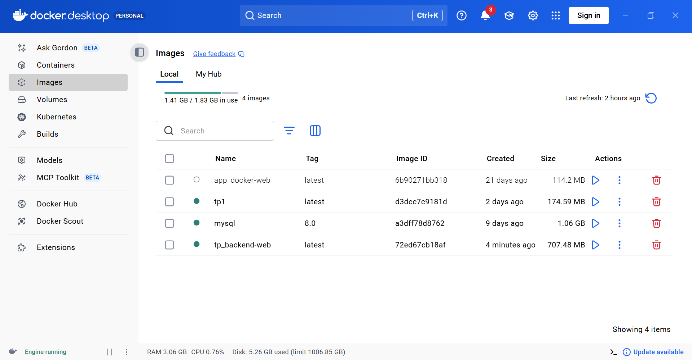
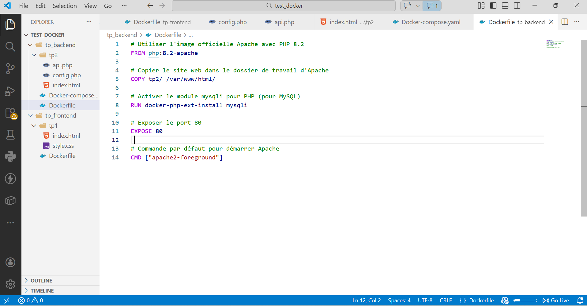
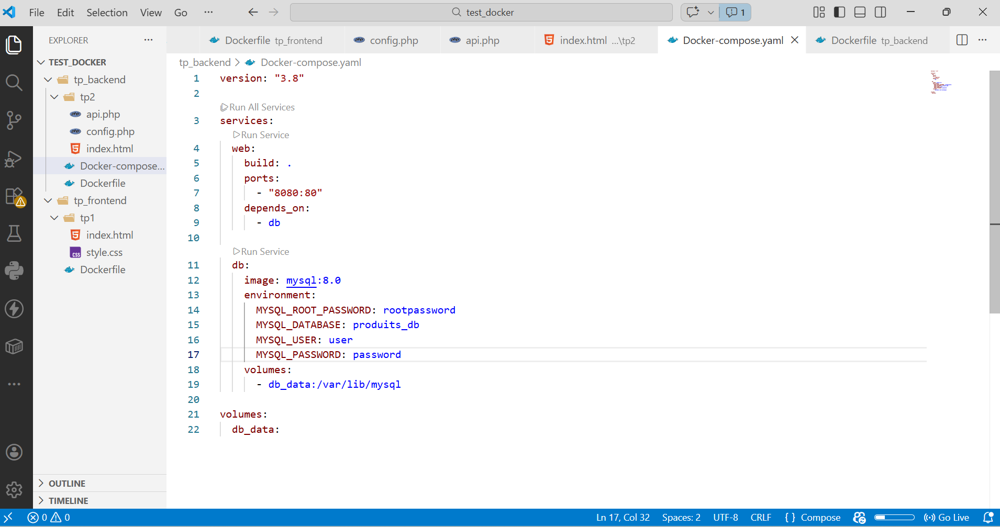
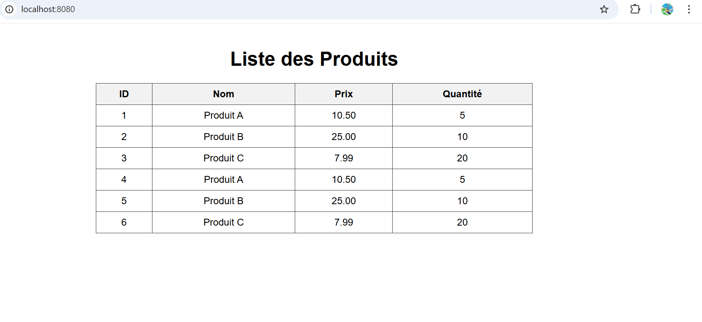

# TP Docker – Application Web PHP / MySQL

Ce projet est une application web simple qui affiche une liste de produits. Il est conteneurisé avec Docker et utilise Docker Compose.

## Structure du projet
      .
      ├── screenshots/
      │ ├── docker_build.png
      │ ├── docker_compose.png
      │ ├── other_163019.png
      │ └── vscode_workspace.png
      ├── tp_backend/
      │ ├── Dockerfile
      │ ├── api.php
      │ ├── config.php
      │ └── index.html
      ├── tp_frontend/
      │ ├── tp1/
      │ └── style.css
      ├── docker-compose.yml
      └── README.md


## 📸 Captures d’écran


## 📸 Captures d’écran

### 1. Images Docker et conteneurs

*Aperçu de l’interface Docker Desktop montrant les images construites (dont `tp_backend-web` et `mysql:8.0`) et l’état des conteneurs.*

### 2. Dockerfile du backend

*Le `Dockerfile` utilisé pour construire l’image du service web (basé sur `php:8.2-apache`).*

### 3. Fichier docker-compose.yml

*Extrait du fichier `docker-compose.yml` définissant les services `web` et `db`, les ports et les volumes.*

### 4. Page d’affichage des produits

*Rendu final de l’application : la liste des produits extraits de la base de données.*

## 🚀 Installation et exécution

1. **Prérequis** : Docker et Docker Compose installés.
2. **Lancer l’application** :
   ```bash
   docker-compose up -d

## 🚀 Installation et exécution

1. **Prérequis** : Docker et Docker Compose installés.
2. **Lancer l’application** :
   ```bash
   docker-compose up -d
   
## Installation et exécution

1. **Prérequis** : Docker (version 20.10+) et Docker Compose.
2. **Lancez les services** :
   ```bash
   docker-compose up -d

## Installation

```bash
  docker-compose up -d
  Accédez ensuite à http://localhost:8080.
  
  Détails techniques
  Backend : PHP 8.2 + Apache, extension mysql (à migrer vers mysqli).
  
  Base de données : MySQL 8.0 avec volume persistant.
  
  Réseau : communication via le nom de service db.
